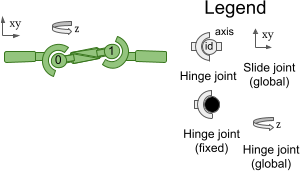
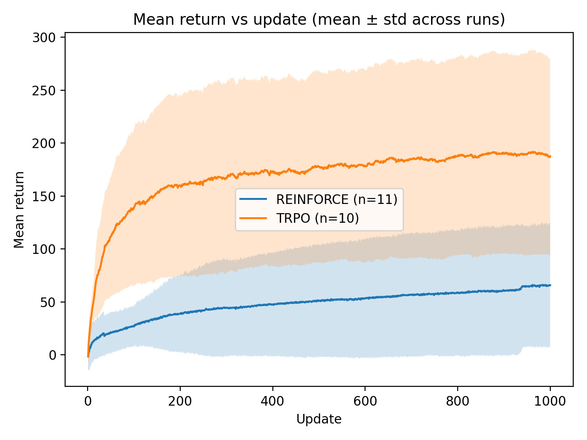

# RL-based Swimmer Control

Comparison of policy gradient methods — REINFORCE and TRPO — on the MuJoCo `Swimmer-v5` environment.

---

## Directory Structure

```
checkpoints/
└── run_YYYYMMDD_HHMMSS/
    ├── history.npz         # Numpy arrays of mean_returns and x_distances
    ├── hyperparams.yaml    # All hyperparameters + run summary statistics
    ├── policy_best.pt      # Policy snapshot at highest mean return
    └── policy_final.pt     # Policy snapshot at end of training

src/
├── advantages/
│   ├── base.py             # Abstract Advantage class with compute(), update(), compute_batch()
│   ├── q_baseline.py       # QBaselineAdvantage: A = G_t - b, where b is a running baseline
│   └── q_value.py          # QValueAdvantage: A = G_t (raw discounted returns, no adjustment)
│
├── algorithms/
│   ├── reinforce.py        # REINFORCE training loop with optional baseline support
│   ├── trpo.py             # TRPO training loop with pluggable advantage estimators
│   ├── ppo.py              # PPO training loop with pluggable advantage estimators
│   ├── conjugate_gradient.py  # Conjugate gradient solver for the Fisher-vector product system
│   └── kl_divergence.py    # Fisher information matrix operator for KL constraint
│
├── baselines/
│   ├── base.py             # Abstract Baseline class with update() and get()
│   └── exponential.py      # ExponentialBaseline: exponential moving average of batch returns
│
├── nn/
│   └── nn_policy.py        # ContinuousPolicy network: tanh-bounded Gaussian policy with save/load
│
├── utils/
│   ├── metrics.py          # MetricsManager: accumulates training metrics and saves run artefacts
│   └── returns.py          # compute_returns() and normalise_returns_batch() utilities
│
└── visualization/
    └── policy_rollout.py   # Loads a checkpoint and records a rollout as a GIF
```

---

## Environment: Swimmer-v5

The Swimmer is a 3-link planar robot submerged in a fluid. It has no legs — locomotion is achieved purely by undulating its body joints.
### State Space $\mathcal{S}$


The observation vector $s_t \in \mathbb{R}^8$ contains:

| Component | Description |
|---|---|
| $q_1, q_2$ | Joint angles of the two actuated links |
| $\dot{q}_0, \dot{q}_1, \dot{q}_2$ | Angular velocities of all three links |
| $\dot{x}, \dot{y}$ | Linear velocity of the torso |
| $\theta$ | Orientation of the torso |

### Action Space $\mathcal{A}$

The action $a_t \in [-1, 1]^2$ controls the torques applied to the two joints:

| Component | Description |
|---|---|
| $a_1$ | Torque applied to joint 1 (between links 1 and 2) |
| $a_2$ | Torque applied to joint 2 (between links 2 and 3) |

### Task and Reward

The goal is to maximise forward displacement along the x-axis. The reward at each timestep is:

$$r_t = v_x - c \cdot \|a_t\|^2$$

where $v_x$ is the forward velocity of the torso, $\|a_t\|^2$ is the squared norm of the applied torques, and $c = 10^{-4}$ is a small control cost penalty. Episodes run for a fixed 1000 timesteps (no early termination).

---

## Methods

We compare REINFORCE and TRPO, two policy gradient algorithms from opposite ends of the sample efficiency vs. implementation complexity spectrum. Both optimise the expected discounted return:

$$J(\theta) = \mathbb{E}_{\tau \sim \pi_\theta} \left[ \sum_{t=0}^{T} \gamma^t r_t \right]$$

### REINFORCE

REINFORCE is a Monte Carlo policy gradient method. After collecting a batch of full episodes, the policy parameters are updated by ascending the gradient:

$$\nabla_\theta J(\theta) = \mathbb{E}_{\tau} \left[ \sum_{t=0}^{T} \nabla_\theta \log \pi_\theta(a_t | s_t) \cdot G_t \right]$$

where $G_t = \sum_{k=t}^{T} \gamma^{k-t} r_k$ is the discounted return from step $t$.

#### Without Baseline

The standard update uses the raw returns $G_t$ as the advantage estimate. This is unbiased but can have high variance, especially early in training when returns fluctuate significantly between episodes.

#### With Exponential Baseline

To reduce variance, we subtract a state-independent baseline $b$ from the returns:

$$\nabla_\theta J(\theta) = \mathbb{E}_{\tau} \left[ \sum_{t=0}^{T} \nabla_\theta \log \pi_\theta(a_t | s_t) \cdot (G_t - b) \right]$$

Subtracting a baseline does not introduce bias since $\mathbb{E}[\nabla_\theta \log \pi_\theta \cdot b] = 0$. We use an **exponential moving average** of batch mean returns as the baseline:

$$b_{k+1} = (1 - \alpha) \cdot b_k + \alpha \cdot \bar{G}_k$$

with $\alpha = 0.05$, where $\bar{G}_k$ is the mean return of batch $k$. The baseline is initialised to the first observed batch mean to avoid cold-start bias from zero.

---

### TRPO

Trust Region Policy Optimisation addresses the instability of large gradient steps in REINFORCE by constraining each update to a trust region defined by a KL divergence bound. Rather than a gradient step, TRPO solves the constrained optimisation problem:

$$\max_\theta \; \mathcal{L}(\theta) = \mathbb{E}_{s, a \sim \pi_{\theta_{\text{old}}}} \left[ \frac{\pi_\theta(a|s)}{\pi_{\theta_{\text{old}}}(a|s)} \cdot A(s, a) \right]$$

$$\text{subject to} \quad \mathbb{E}_s \left[ D_{\text{KL}} \left( \pi_{\theta_{\text{old}}}(\cdot|s) \,\|\, \pi_\theta(\cdot|s) \right) \right] \leq \delta$$

The constraint ensures the new policy does not deviate too far from the old one, guaranteeing monotonic improvement under certain conditions. The update direction is computed using the **natural policy gradient**:

$$\theta \leftarrow \theta + \sqrt{\frac{2\delta}{s^\top F s}} \cdot s, \qquad s = F^{-1} \nabla_\theta \mathcal{L}(\theta)$$

where $F$ is the Fisher information matrix. Since $F$ is too large to invert directly, we use the **conjugate gradient** method to compute $F^{-1}g$ via Fisher-vector products, followed by a **backtracking line search** to satisfy the KL constraint.


#### TRPO with Q-value Estimate (original paper approach)

Following the original TRPO paper, we use the discounted return $G_t$ as a Monte Carlo estimate of the action-value function $Q^\pi(s_t, a_t)$:

$$\mathbb{E}[Q^\pi(s_t, a_t)] = \mathbb{E}\left[\sum_{k=t}^{T} \gamma^{k-t} r_k\right] = G_t$$

The surrogate objective therefore becomes:

$$\mathcal{L}(\theta) = \mathbb{E}_{s, a \sim \pi_{\theta_{\text{old}}}} \left[ \frac{\pi_\theta(a|s)}{\pi_{\theta_{\text{old}}}(a|s)} \cdot G_t \right]$$

This is an unbiased estimate of the true objective but can exhibit high variance since raw returns fluctuate significantly across episodes.

#### TRPO with Advantage Estimate ($Q - V$)

The advantage function is defined as $A^\pi(s_t, a_t) = Q^\pi(s_t, a_t) - V^\pi(s_t)$. We estimate it as:

$$A(s_t, a_t) = G_t - b_t$$

where $G_t$ is the Monte Carlo estimate of $Q^\pi$ and $b_t$ is an exponential moving average of batch mean returns used as an estimate of $V^\pi$:

$$b_t \leftarrow (1 - \alpha)b_t + \alpha\ \frac{1}{N} \sum_{i=1}^{N} G_t^{(i)}$$, 
where $N$ is the batch size and $i$ is index of episode in the batch.

---

### PPO 

Proximal Policy Optimisation is a more practical variant of TRPO that replaces the hard KL constraint with a clipped surrogate objective. The update maximises:

$$\mathcal{L}^{\text{CLIP}}(\theta) = \mathbb{E}_{s, a \sim \pi_{\theta_{\text{old}}}} \left[ \min \left( r_t(\theta) A(s, a), \; \text{clip}(r_t(\theta), 1 - \epsilon, 1 + \epsilon) A(s, a) \right) \right]$$

where $r_t(\theta) = \frac{\pi_\theta(a|s)}{\pi_{\theta_{\text{old}}}(a|s)}$ is the probability ratio. The clipping prevents updates that would change the policy too much in one step, while still allowing multiple epochs of minibatch updates on the same data. 

While original paper proposes using a value function approximation, we use only returns-based estimates of value function. 

Also, for simplicity, we perform only one gradient update per batch of data, rather than multiple epochs of minibatch updates.

---

## Hyperparameters

### Shared Parameters

Both algorithms share the following parameters with identical values:

| Parameter | Value | Description |
|---|---|---|
| `batch_size` | 32 | Number of parallel episodes collected per update |
| `hidden_dim` | 64 | Number of units in the policy network hidden layer |
| `action_bound` | 1.0 | Tanh output is scaled by this value, bounding actions to $[-1, 1]^2$ |
| `covariance_scale` | 0.25 | Diagonal value of the fixed Gaussian covariance matrix $\Sigma = \sigma^2 I$, controls exploration |
| `gamma` | 0.999 | Discount factor; close to 1 to preserve long-horizon reward signal in 1000-step episodes |
| `num_updates` | 1000 | Total number of gradient updates |
| `max_steps` | 1000 | Maximum timesteps per episode (Swimmer truncates here, never terminates early) |
| `normalise_returns` | true | Standardise returns to zero mean and unit variance across the batch before computing the loss |

### REINFORCE-specific Parameters

| Parameter | Value | Description |
|---|---|---|
| `lr` | 3e-4 | Adam learning rate |
| `baseline_name` | `"Exponential_0.05"` (optional) | Exponential moving average baseline with $\alpha = 0.05$; omitted for the no-baseline variant |

### TRPO-specific Parameters

| Parameter | Value | Description |
|---|---|---|
| `delta_kl` | 0.01 | Maximum allowed KL divergence $\delta$ between old and new policy per update |
| `max_CG_iters` | 10 | Maximum iterations of the conjugate gradient solver when computing $F^{-1}g$ |
| `kl_subsample` | 0.1 | Fraction of collected state transitions used to estimate the Fisher information matrix; reduces memory and compute cost |
| `line_search_step_multiplier` | 0.5 | Factor by which the step size is shrunk at each backtracking line search iteration |
| `advantage_name` | `"QBaseline_Exponential_0.05"` | Advantage estimator: $A_t = G_t - b$ where $b$ is an exponential moving average baseline with $\alpha = 0.05$ |

---

## Results and Conclusions

.jpg)


Both algorithms are trained with 16 parallel environments (`AsyncVectorEnv`) for sample efficiency, with return normalisation enabled. Metrics tracked per update are mean episode return and mean x-displacement.

## Prompts

[link to prompts used](https://drive.google.com/drive/folders/1vRaMqep8KoPFmSn-GoZBwHTVXBJnEas_?usp=sharing)